# 02-Domain-Model

Source: CONTEXT.md. Colour key: blue = work records, green = Staff side, grey = outside PSP or outside the product.

```mermaid
---
title: 02-Domain-Model
config:
  look: classic
  theme: base
  themeVariables:
    fontFamily: "Shantell Sans, Comic Sans MS, cursive"
    fontSize: 16px
    background: "#f9fafb"
    lineColor: "#1d1d1d"
    textColor: "#1d1d1d"
    primaryTextColor: "#1d1d1d"
    primaryColor: "#dce1f8"
    primaryBorderColor: "#4465e9"
    secondaryColor: "#ecdcf2"
    secondaryBorderColor: "#ae3ec9"
    tertiaryColor: "#d3e9e3"
    tertiaryBorderColor: "#099268"
    clusterBkg: "transparent"
    clusterBorder: "#4ba1f1"
    edgeLabelBackground: "#f9fafb"
    noteBkgColor: "#fef4d6"
    noteBorderColor: "#f1ac4b"
    noteTextColor: "#1d1d1d"
    actorBkg: "#dce1f8"
    actorBorder: "#4465e9"
    actorTextColor: "#1d1d1d"
    actorLineColor: "#9fa8b2"
    signalColor: "#1d1d1d"
    signalTextColor: "#1d1d1d"
    activationBkgColor: "#ecdcf2"
    activationBorderColor: "#ae3ec9"
    labelBoxBkgColor: "#f8e2d4"
    labelBoxBorderColor: "#e16919"
    loopTextColor: "#1d1d1d"
    attributeBackgroundColorOdd: "#ffffff"
    attributeBackgroundColorEven: "#f3f5fc"
    taskBkgColor: "#dce1f8"
    taskBorderColor: "#4465e9"
    taskTextColor: "#1d1d1d"
    activeTaskBkgColor: "#d3e9e3"
    activeTaskBorderColor: "#099268"
    doneTaskBkgColor: "#eceef0"
    doneTaskBorderColor: "#9fa8b2"
    critBkgColor: "#f4dadb"
    critBorderColor: "#e03131"
    sectionBkgColor: "#f3f5fc"
    sectionBkgColor2: "#ffffff"
    gridColor: "#d6dae0"
    todayLineColor: "#e16919"
    pie1: "#4465e9"
    pie2: "#ae3ec9"
    pie3: "#099268"
    pie4: "#e16919"
    pie5: "#f1ac4b"
    pie6: "#9fa8b2"
    pieStrokeColor: "#1d1d1d"
    pieOuterStrokeColor: "#1d1d1d"
    cScale0: "#dce1f8"
    cScale1: "#ecdcf2"
    cScale2: "#d3e9e3"
    cScale3: "#f8e2d4"
    cScale4: "#fef4d6"
    cScale5: "#f4dadb"
    cScale6: "#dbf0e0"
    cScale7: "#eceef0"
    git0: "#4465e9"
    git1: "#ae3ec9"
    git2: "#099268"
    git3: "#e16919"
  flowchart:
    curve: basis
---
classDiagram
  direction LR
  class Customer {
    +String email
  }
  class Request
  class Task {
    +proposeClose()
  }
  class Staff {
    +readAnyTask()
  }
  class TaskMaster {
    +addCustomer(task, customer)
    +reassignOwner(task, staff)
  }
  class Issue {
    <<GitHub tracker>>
  }
  Customer "1" --> "*" Request : reports
  Staff "1" --> "*" Request : assesses
  Request "1" --> "0..1" Task : opens
  Task "*" --> "1" Staff : owner
  Customer "*" --> "*" Task : added to
  Staff <|-- TaskMaster
  note for Task "Owner = the one Staff member responsible. Only the Owner may propose closing."
  note for Issue "Dev work on Tasuku itself. Never a record inside the product."
  class Customer:::grey
  class Request:::blue
  class Task:::blue
  class Staff:::green
  class TaskMaster:::green
  class Issue:::grey

  classDef blue    fill:#dce1f8,stroke:#4465e9,stroke-width:2px,color:#1d1d1d
  classDef lblue   fill:#ddeefc,stroke:#4ba1f1,stroke-width:2px,color:#1d1d1d
  classDef violet  fill:#ecdcf2,stroke:#ae3ec9,stroke-width:2px,color:#1d1d1d
  classDef orange  fill:#f8e2d4,stroke:#e16919,stroke-width:2px,color:#1d1d1d
  classDef yellow  fill:#fef4d6,stroke:#f1ac4b,stroke-width:2px,color:#1d1d1d
  classDef green   fill:#d3e9e3,stroke:#099268,stroke-width:2px,color:#1d1d1d
  classDef lred    fill:#f4dadb,stroke:#f87777,stroke-width:2px,color:#1d1d1d
  classDef grey    fill:#eceef0,stroke:#9fa8b2,stroke-width:2px,color:#1d1d1d
```

## Gaps to confirm

- Can a Task exist without a Request (internal work)? Can one Request lead to more than one Task?
- "Write access is granted on a Task": who holds it is not spelled out, so it is not drawn.
- Can a Task Master also be the Owner of a Task?
- Method names (readAnyTask, addCustomer, reassignOwner, proposeClose) are working labels for the rules in CONTEXT.md.
