# 04-Task-Lifecycle

Source: Spec #1 (GitHub issue) transition table, CONTEXT.md. Colour key: grey = not started, blue = being worked, yellow = waiting for the Customer, green = finished, light red = abandoned.

```mermaid
---
title: 04-Task-Lifecycle
config:
  look: handDrawn
  handDrawnSeed: 3
  theme: base
  themeVariables:
    fontFamily: "Shantell Sans, Comic Sans MS, cursive"
    fontSize: 16px
    background: "#f9fafb"
    lineColor: "#1d1d1d"
    textColor: "#1d1d1d"
    primaryTextColor: "#1d1d1d"
    primaryColor: "#dce1f8"
    primaryBorderColor: "#4465e9"
    secondaryColor: "#ecdcf2"
    secondaryBorderColor: "#ae3ec9"
    tertiaryColor: "#d3e9e3"
    tertiaryBorderColor: "#099268"
    clusterBkg: "transparent"
    clusterBorder: "#4ba1f1"
    edgeLabelBackground: "#f9fafb"
    noteBkgColor: "#fef4d6"
    noteBorderColor: "#f1ac4b"
    noteTextColor: "#1d1d1d"
    actorBkg: "#dce1f8"
    actorBorder: "#4465e9"
    actorTextColor: "#1d1d1d"
    actorLineColor: "#9fa8b2"
    signalColor: "#1d1d1d"
    signalTextColor: "#1d1d1d"
    activationBkgColor: "#ecdcf2"
    activationBorderColor: "#ae3ec9"
    labelBoxBkgColor: "#f8e2d4"
    labelBoxBorderColor: "#e16919"
    loopTextColor: "#1d1d1d"
    attributeBackgroundColorOdd: "#ffffff"
    attributeBackgroundColorEven: "#f3f5fc"
    taskBkgColor: "#dce1f8"
    taskBorderColor: "#4465e9"
    taskTextColor: "#1d1d1d"
    activeTaskBkgColor: "#d3e9e3"
    activeTaskBorderColor: "#099268"
    doneTaskBkgColor: "#eceef0"
    doneTaskBorderColor: "#9fa8b2"
    critBkgColor: "#f4dadb"
    critBorderColor: "#e03131"
    sectionBkgColor: "#f3f5fc"
    sectionBkgColor2: "#ffffff"
    gridColor: "#d6dae0"
    todayLineColor: "#e16919"
    pie1: "#4465e9"
    pie2: "#ae3ec9"
    pie3: "#099268"
    pie4: "#e16919"
    pie5: "#f1ac4b"
    pie6: "#9fa8b2"
    pieStrokeColor: "#1d1d1d"
    pieOuterStrokeColor: "#1d1d1d"
    cScale0: "#dce1f8"
    cScale1: "#ecdcf2"
    cScale2: "#d3e9e3"
    cScale3: "#f8e2d4"
    cScale4: "#fef4d6"
    cScale5: "#f4dadb"
    cScale6: "#dbf0e0"
    cScale7: "#eceef0"
    git0: "#4465e9"
    git1: "#ae3ec9"
    git2: "#099268"
    git3: "#e16919"
  themeCSS: ".rough-node path[stroke-width='4'] { stroke-width: 6.4px !important; } .cluster path { stroke: #4ba1f1 !important; stroke-width: 2px !important; } .cluster[id$=-outside] path, .cluster[id$=-dev] path { stroke: #9fa8b2 !important; }"
  flowchart:
    curve: basis
---
stateDiagram-v2
  direction LR
  state "In progress" as InProgress
  [*] --> Open : Staff opens a Task
  Open --> InProgress : first Staff comment
  InProgress --> Resolved : Owner or Task Master
  Resolved --> InProgress : Reopen, Customer or Task Master
  Resolved --> Done : Customer, Task Master, or auto after 48 h
  Open --> Done : Customer
  InProgress --> Done : Customer
  Open --> Cancelled : Customer, Owner or Task Master
  InProgress --> Cancelled : Customer, Owner or Task Master
  Done --> [*]
  Cancelled --> [*]
  note right of Resolved : With no Customer on the Task the Owner marks it Done alone, from any state before Done
  note right of Open : A Customer comment leaves the Task Open
  class Open grey
  class InProgress blue
  class Resolved yellow
  class Done green
  class Cancelled lred

  classDef blue    fill:#dce1f8,stroke:#4465e9,stroke-width:2px,color:#1d1d1d
  classDef lblue   fill:#ddeefc,stroke:#4ba1f1,stroke-width:2px,color:#1d1d1d
  classDef violet  fill:#ecdcf2,stroke:#ae3ec9,stroke-width:2px,color:#1d1d1d
  classDef orange  fill:#f8e2d4,stroke:#e16919,stroke-width:2px,color:#1d1d1d
  classDef yellow  fill:#fef4d6,stroke:#f1ac4b,stroke-width:2px,color:#1d1d1d
  classDef green   fill:#d3e9e3,stroke:#099268,stroke-width:2px,color:#1d1d1d
  classDef lred    fill:#f4dadb,stroke:#f87777,stroke-width:2px,color:#1d1d1d
  classDef grey    fill:#eceef0,stroke:#9fa8b2,stroke-width:2px,color:#1d1d1d
```

## Gaps to confirm

- Done and Cancelled are terminal (spec #1 story 70). Cancelling a Resolved Task is not drawn: the spec table allows Cancelled only from Open and In progress.
- Who may Reopen: CONTEXT.md does not say, spec #1 says Customer or Task Master, and v1-plan.md says Customer only.
- The 48 h closure period (and the 24 h reminder before it) is a Task Master setting, see 09 and the spec.
