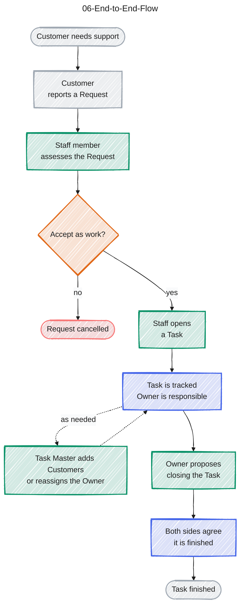

# 06-End-to-End-Flow

Source: CONTEXT.md. Colour key: grey = Customer, green = Staff side (Staff, Task Master, Owner), orange = decision, blue = the Task being worked, light red = cancelled.

## Gaps to confirm

- How the Customer who reported gets added to the Task (CONTEXT.md says only a Task Master adds Customers).
- Who becomes the first Owner when a Task is opened.
- What happens if the other side does not agree to close; the flow only shows the agreed path.
- How a Customer sends a Request (channel).
