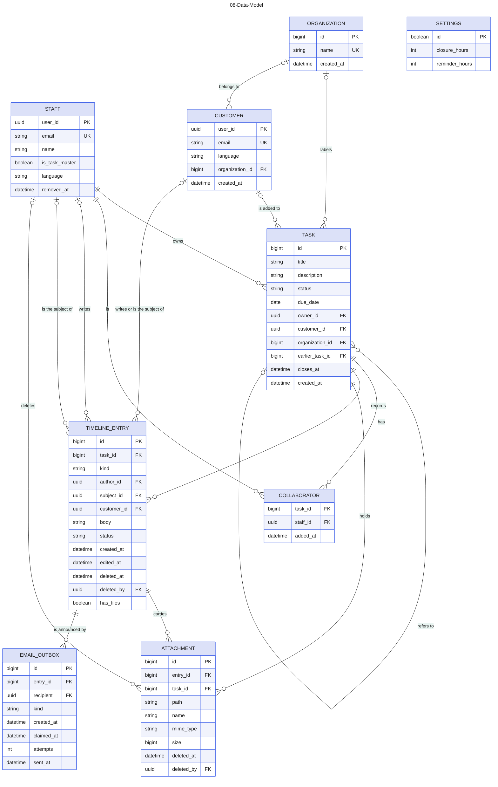

# 08-Data-Model

Source: Spec #1 (GitHub issue) sections Task model, Timeline and Attachments. Colour key: clean lines for technical reference, entities blue, rows alternate. Attribute names are working labels, not final column names.

## Gaps to confirm

- EMAIL_OUTBOX (#10) is built (table `private.email_outbox`, not reachable through the API). One row per person to tell about a Timeline entry; `kind` is `added`, `comment`, `resolved` or `cancelled`, since #11 `reminder` or `closed`, and since #12 `assigned` (to the new Owner) or `unassigned` (to the previous one). The two of #12 are queued by `reassign_task` itself, on the `owner_changed` entry; every other kind but the reminder by the trigger on the Timeline. A reminder is not an entry of its own: it hangs on the entry that made the Task Resolved, so an entry holds one email of each kind for a recipient, which keeps a reminder to once per Resolved. `recipient` is an Auth account id, a Staff member or a Customer, so no line is drawn to either. A row is dropped unsent when its comment was deleted or its recipient left the Task or Staff, a `resolved` or `reminder` row when the Task has moved on since, and an `assigned` or `unassigned` row that a later reassignment has made wrong; `sent_at` is set by the Edge Function `send-emails`.
- Request is not drawn: spec #1 has no Request record (see the Request question in 02, 03 and 06).
- Thread is not drawn: the Storybook README says it is planned for a later release.
- TIMELINE_ENTRY (#5) is built. Its kind is `comment`, `opened`, `moved`, `collaborator_added` or `collaborator_removed` (#6), `customer_added` or `customer_removed` (#7), `attachment_deleted` (#9), `owner_changed` (#12); later issues add kinds. `subject_id` is set only on the two Collaborator kinds, where it names the Staff member added or removed, and on `owner_changed`, where it names the new Owner; `author_id` is who did it. No entry names the previous Owner: it is whoever the entries before made the Owner, starting from the author of `opened`. A comment deleted by a Task Master is the same entry with its `body` emptied and `deleted_at` set, not a separate kind. `status` is set only on `moved`. `author_id` and `customer_id` are both empty when Tasuku itself made the entry.
- `author_id` names a Staff member only. `customer_id` (#7) names the Customer an entry is by or about: the author of a comment a Customer wrote, and the Customer a `customer_added` or `customer_removed` entry concerns (`author_id` is then the Staff member who did it). A comment has exactly one of the two. A `moved` entry (#8) names who moved the Task in the same way: a Staff member in `author_id`, a Customer in `customer_id`, neither when Tasuku did it.
- A Staff member's email can be the Customer of a Task (decided by the user in #7); what they write there is stored with `author_id`, as Staff, and so is a status change they make as the Customer (#8).
- SETTINGS (#11) is built (table `settings`, one row): the closure period (48 h) and the reminder lead time (24 h), in whole hours, the lead time at least 1 and shorter than the period, the period 720 at most. Staff read it, a Task Master changes it. No line is drawn: it relates to no Task. `TASK.closes_at` is set from it when a Task becomes Resolved and is empty in every other status.
- A Task Master is a flag on STAFF, not a separate entity (spec #1, Identity and roles).
- STAFF (#2, #3), TASK (#4), TIMELINE_ENTRY (#5), COLLABORATOR (#6, table `task_collaborators`, keyed by `task_id` and `staff_id`), ORGANIZATION and CUSTOMER (#7) are built (`supabase/migrations/`). The key of STAFF is the Auth account id, `user_id`; the key of TASK is a running number, so every `task_id` is drawn as `bigint`. The key of TIMELINE_ENTRY is a running number too, so ATTACHMENT.entry_id is drawn as `bigint`. The key of CUSTOMER is the Auth account id, `user_id`, like STAFF; the key of ORGANIZATION is a running number, and its name is unique whatever its capitals. The reference of a TASK to an earlier one is `earlier_task_id` (#8): it must be lower than the Task's own number, and it is a detail whoever writes on the Task may change.
- ATTACHMENT (#9) is built (table `attachments`). A file is part of a comment: `entry_id` is that comment, and `has_files` on the entry lets a comment have files and no text. `path` names the object in the private Storage bucket `attachments` (`<task>/<uuid>`); the bytes are not in the database. `mime_type` and `size` are what Storage recorded. A deleted file is the same row with `name` emptied and `deleted_at`, `deleted_by` set, and an `attachment_deleted` entry on the Timeline; deleting a comment deletes its files without that entry. The object itself is erased through Storage afterwards.
- A Task's details change only while it is not Done or Cancelled (#4, from story 70). Spec #1 does not say this about details outright.
- The Owner of a Task is never also its COLLABORATOR. Reassigning the Owner (#12, `reassign_task`, a Task Master only) keeps it true: the previous Owner gets a COLLABORATOR row, also when removed from Staff, and the new Owner's row is deleted. Neither writes a Collaborator entry on the Timeline; the one entry is `owner_changed`. A trigger on COLLABORATOR reads the Owner again once it holds the Task, so adding someone at the moment the Task is given to them is refused.
