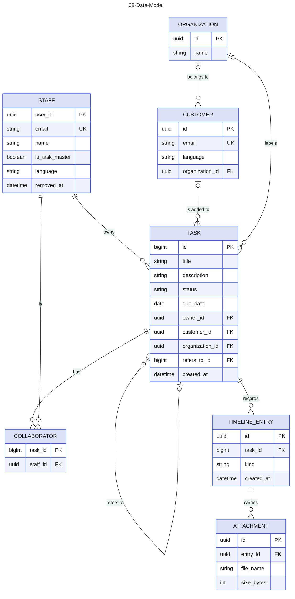

# 08-Data-Model

Source: Spec #1 (GitHub issue) sections Task model, Timeline and Attachments. Colour key: clean lines for technical reference, entities blue, rows alternate. Attribute names are working labels, not final column names.

## Gaps to confirm

- Request is not drawn: spec #1 has no Request record (see the Request question in 02, 03 and 06).
- Thread is not drawn: the Storybook README says it is planned for a later release.
- TIMELINE_ENTRY.kind is comment, event or tombstone (a comment deleted by a Task Master). How the author is stored (Staff or Customer) is not decided in the spec.
- Closure period (48 h) and reminder lead time (24 h) are stored settings, left out as they do not relate to a Task.
- A Task Master is a flag on STAFF, not a separate entity (spec #1, Identity and roles).
- STAFF (#2, #3) and TASK (#4) are built (`supabase/migrations/`). The key of STAFF is the Auth account id, `user_id`; the key of TASK is a running number, so every `task_id` is drawn as `bigint`. TASK has no `customer_id`, `organization_id` or `refers_to_id` yet. The other entities are still drawn from the spec, and their key and column names may change when they are built.
- A Task's details change only while it is not Done or Cancelled (#4, from story 70). Spec #1 does not say this about details outright.
