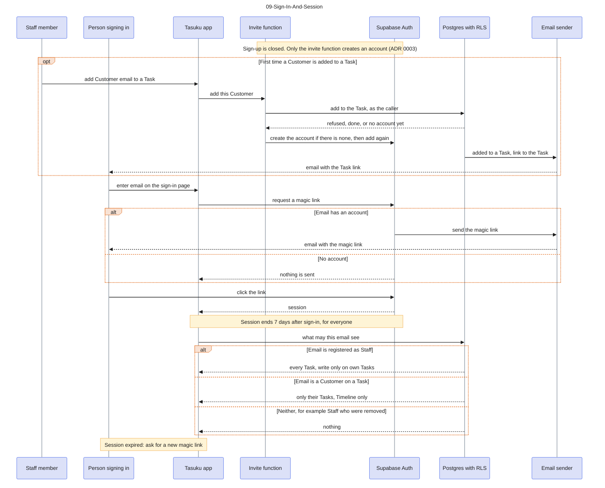

# 09-Sign-In-And-Session

Source: Spec #1 (GitHub issue) stories 1-8 and 25, ADR 0003, SignInScreen in the Storybook. Colour key: blue = people and the app, violet = Supabase Auth, notes = rules. The alt block shows that what a person sees is decided after sign-in.

## Gaps to confirm

- Session length is one setting for the whole project, so Staff and Customers both get 7 days from sign-in (decided in #3; spec #1 still says 30 days for Staff). On the cloud project it needs the Pro plan and is not set yet (deploy.md section 7).
- A signed-in person with no access sees a message that the email has no access to any Task yet (#2).
- The sign-in page tells a person that their email is not registered, instead of always saying "check your email" (decided in PR #17). It is not drawn.
- At sign-in the language stored for the person always wins over the one the browser remembered (decided in PR #17). It is not drawn.
- Magic link lifetime and rate limits are not described.
- Adding a Customer is built (#7, `invite-customer`): the database decides whether the caller may, and the function creates an account only for an Owner or Task Master and only when the email has none. The email to the Customer is not sent yet (#10); the Task page asks Staff to tell them.
- Installation seeding of the first Task Master (story 7) is a script run with the secret key (`app/scripts/seed.mjs`), not the invite function. The Task Master registering Staff emails (story 9) uses the invite function from #3. Both are separate flows, not drawn.
