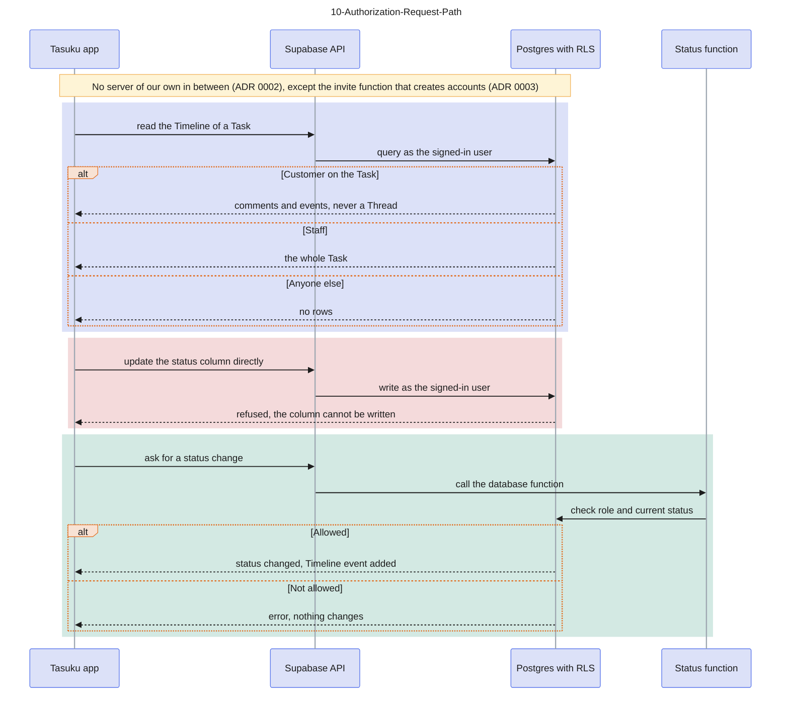

# 10-Authorization-Request-Path

Source: ADR 0002, ADR 0003, spec #1 section Task model (status changes). Colour key: blue = the app, violet = Supabase API and database function, green = Postgres with RLS, light red = refused. Hiding something in the UI is never a security measure.

## Gaps to confirm

- The policies on STAFF (#2, #3) and TASK (#4) exist in `supabase/migrations/`: Staff read every Task, anyone else gets no rows, and the status column is granted to nobody, so the first two blocks are built for Staff. The Timeline is built for Staff too (#5): Staff read every entry and anyone else gets no rows. The Customer branch waits for #7.
- The only status change built so far is automatic: the first Staff comment on an Open Task moves it to In progress and adds the Timeline event (#5), with no function for the app to call. The status functions of the third block come with #8, so no name is shown.
- Attachment files are protected by storage rules and signed URLs (spec #1), not by this path; a separate diagram would cover them.
- ADR 0002 requires the policies to be tested as a Customer, a non-member Staff, a Collaborator, an Owner and a Task Master; 11 shows what each of them may do.
