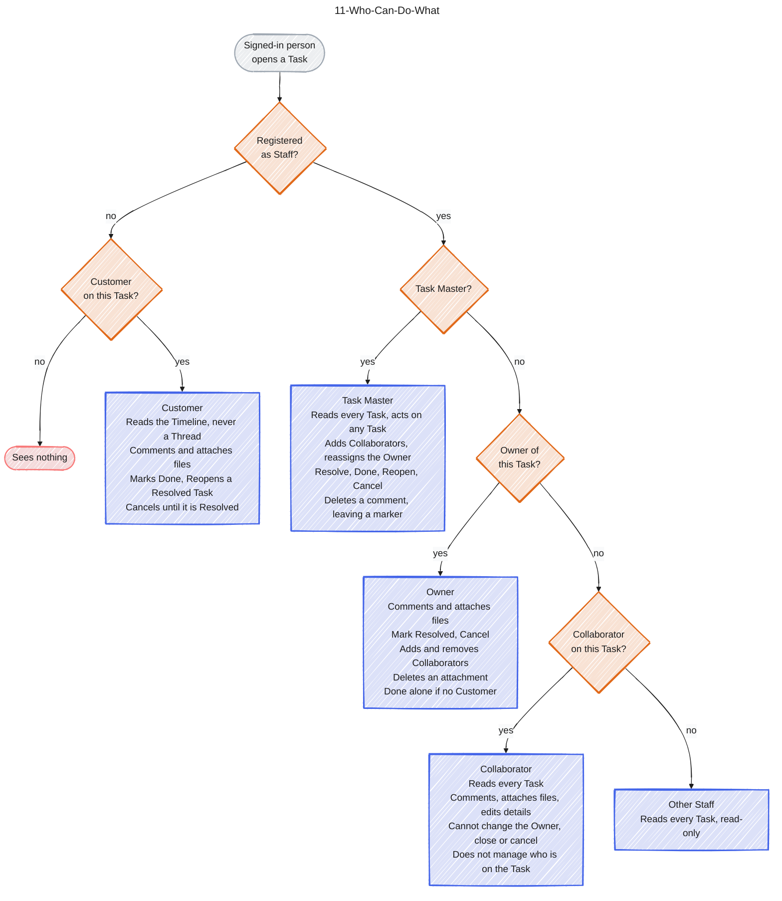

# 11-Who-Can-Do-What

Source: Spec #1 (GitHub issue), ADR 0002, TaskScreen and CustomerTaskScreen in the Storybook. Colour key: grey = start, orange = question, blue = what that viewer may do, light red = no access. The five outcomes are the five roles ADR 0002 says to test.

## Gaps to confirm

- Whether one email can be both Staff and Customer is not described.
- A Task Master who is also the Owner is drawn as Task Master, who can do everything an Owner can.
- The Customer can add attachments through the Timeline (stories 47-48); only an Owner or Task Master can delete one (story 54).
- Whether a Collaborator may remove themselves is not covered by the spec. As built in #6 they cannot: only the Owner and a Task Master remove a Collaborator (confirmed by the user, 7 Oct 2026).
- As built in #6, nobody adds or removes a Collaborator once the Task is Done or Cancelled, and a person removed from Staff cannot be added until a Task Master adds them back to Staff (both confirmed by the user, 7 Oct 2026). The spec does not say this outright.
- The Collaborator box follows CONTEXT.md as changed in #3. Spec #1 (story 30) still describes a Collaborator as commenting and attaching only.
