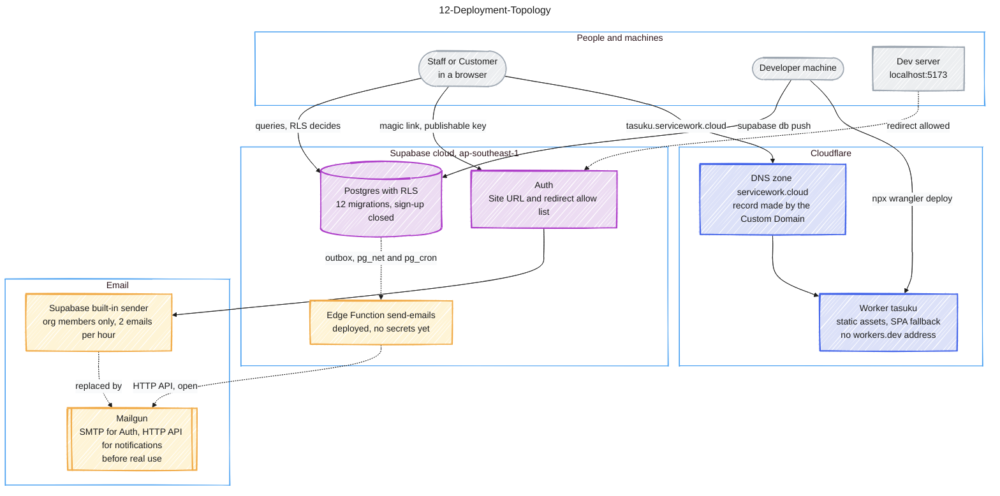

# 12-Deployment-Topology

Source: docs/deploy.md (sections 1-5 and 8, status list) and ADR 0001. Colour key: grey = people and machines, blue = Cloudflare, violet = Supabase, yellow = temporary or not in place yet. The dotted lines are open steps or one-off checks.

## Gaps to confirm

- Notification emails (#10, deploy.md section 8) never use the built-in sender: the database calls the Edge Function `send-emails`, which sends through Mailgun's HTTP API because Edge Functions cannot open ports 25 and 587. The function is deployed but has no secrets, and the Vault has none, so nothing is sent and the outbox only fills. The two invite functions (deploy.md section 6) are deployed and still not drawn.
- The build exists since #2 (`app/`): it takes the Supabase URL and the publishable key from environment variables and refuses to run without them. It is deployed to the Worker; the config is `app/wrangler.jsonc`.
- The seed of the first Task Master is a script (`app/scripts/seed.mjs`, deploy.md section 5); it was run once against the cloud project and is not drawn.
- The local Supabase stack from #2 is not drawn; deploy.md says it does not use the cloud redirect list.
- Earlier diagrams named Cloudflare Pages; deploy.md line 12 says the deployed target is a Worker with static assets.
