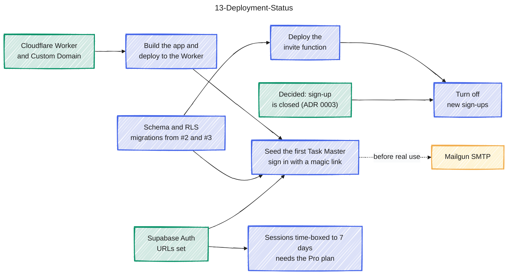

# 13-Deployment-Status

Source: docs/deploy.md status checklist and sections 4-5. Colour key: green = done, blue = open step, yellow = before real use. Arrows mean must finish before.

## Gaps to confirm

- Sign-ups can only be turned off once the invite function is deployed (deploy.md section 6); before that nobody new could be added.
- The 7-day session setting needs the Supabase Pro plan; on the Free plan a session never expires (deploy.md section 7).
- The first Task Master must be a Supabase organization member while the built-in email sender is in use (deploy.md section 3), so the seed step is also gated on that.
- This diagram mirrors the checklist; when a box in deploy.md is ticked, its colour here changes to green.
