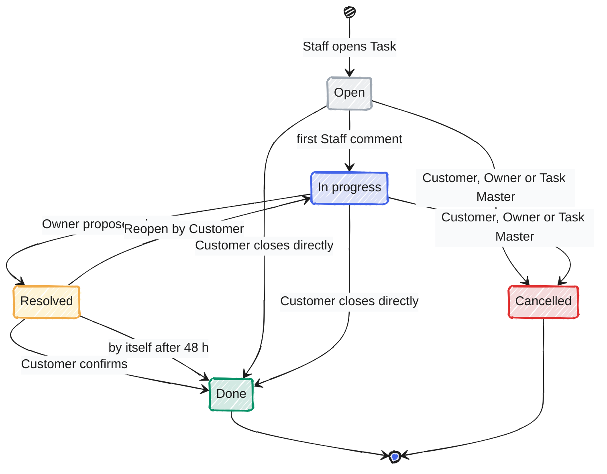
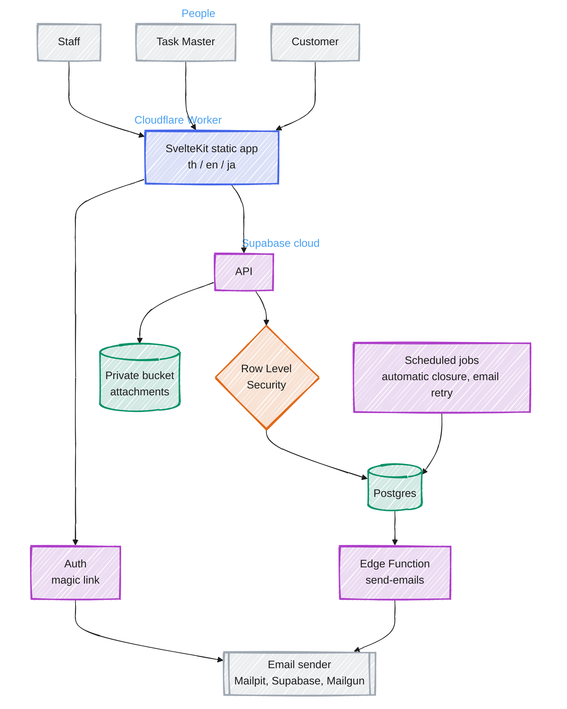

# Tasuku v1 plan diagrams

Diagrams for the v1 spec ([#1](https://github.com/jedt3d/tasuku/issues/1)). Styled preview: open `v1-plan.html` in a browser.

## Issue dependency graph

Arrows mean "must finish before". Grey = foundation, blue = core Task flow, violet = Staff teamwork, green = Customer-facing, yellow = email and automation, orange = human-only step.

```mermaid
---
config:
  look: handDrawn
  handDrawnSeed: 3
  theme: base
  themeVariables:
    fontFamily: "Shantell Sans, Comic Sans MS, cursive"
    fontSize: 16px
    background: "#f9fafb"
    lineColor: "#1d1d1d"
    textColor: "#1d1d1d"
    primaryTextColor: "#1d1d1d"
    primaryColor: "#dce1f8"
    primaryBorderColor: "#4465e9"
    secondaryColor: "#ecdcf2"
    secondaryBorderColor: "#ae3ec9"
    tertiaryColor: "#d3e9e3"
    tertiaryBorderColor: "#099268"
    clusterBkg: "transparent"
    clusterBorder: "#4ba1f1"
    edgeLabelBackground: "#f9fafb"
    noteBkgColor: "#fef4d6"
    noteBorderColor: "#f1ac4b"
    noteTextColor: "#1d1d1d"
    actorBkg: "#dce1f8"
    actorBorder: "#4465e9"
    actorTextColor: "#1d1d1d"
    actorLineColor: "#9fa8b2"
    signalColor: "#1d1d1d"
    signalTextColor: "#1d1d1d"
    activationBkgColor: "#ecdcf2"
    activationBorderColor: "#ae3ec9"
    labelBoxBkgColor: "#f8e2d4"
    labelBoxBorderColor: "#e16919"
    loopTextColor: "#1d1d1d"
    attributeBackgroundColorOdd: "#ffffff"
    attributeBackgroundColorEven: "#f3f5fc"
    taskBkgColor: "#dce1f8"
    taskBorderColor: "#4465e9"
    taskTextColor: "#1d1d1d"
    activeTaskBkgColor: "#d3e9e3"
    activeTaskBorderColor: "#099268"
    doneTaskBkgColor: "#eceef0"
    doneTaskBorderColor: "#9fa8b2"
    critBkgColor: "#f4dadb"
    critBorderColor: "#e03131"
    sectionBkgColor: "#f3f5fc"
    sectionBkgColor2: "#ffffff"
    gridColor: "#d6dae0"
    todayLineColor: "#e16919"
    pie1: "#4465e9"
    pie2: "#ae3ec9"
    pie3: "#099268"
    pie4: "#e16919"
    pie5: "#f1ac4b"
    pie6: "#9fa8b2"
    pieStrokeColor: "#1d1d1d"
    pieOuterStrokeColor: "#1d1d1d"
    cScale0: "#dce1f8"
    cScale1: "#ecdcf2"
    cScale2: "#d3e9e3"
    cScale3: "#f8e2d4"
    cScale4: "#fef4d6"
    cScale5: "#f4dadb"
    cScale6: "#dbf0e0"
    cScale7: "#eceef0"
    git0: "#4465e9"
    git1: "#ae3ec9"
    git2: "#099268"
    git3: "#e16919"
  flowchart:
    curve: basis
---
flowchart LR
  t1["#2 Walking skeleton<br/>sign in as Task Master"]:::grey
  t2["#3 Task Master<br/>manages Staff"]:::blue
  t3["#4 Staff open and<br/>browse Tasks"]:::blue
  t4["#5 Timeline<br/>comments"]:::blue
  t5["#6 Collaborators"]:::violet
  t6["#7 Customer<br/>on a Task"]:::green
  t7["#8 Closing and<br/>cancelling"]:::green
  t8["#9 Attachments"]:::green
  t9["#10 Email<br/>notifications"]:::yellow
  t10["#11 Automatic<br/>closure"]:::yellow
  t11["#12 Task Master<br/>reassigns Owner"]:::violet
  t12[["#13 Deploy to Cloudflare<br/>and Supabase cloud"]]:::orange
  t1 --> t2 --> t3 --> t4
  t4 --> t5 --> t11
  t4 --> t6
  t6 --> t7 --> t9 --> t10
  t6 --> t8
  t1 --> t12
  classDef grey fill:#eceef0,stroke:#9fa8b2,stroke-width:2px,color:#1d1d1d
  classDef blue fill:#dce1f8,stroke:#4465e9,stroke-width:2px,color:#1d1d1d
  classDef violet fill:#ecdcf2,stroke:#ae3ec9,stroke-width:2px,color:#1d1d1d
  classDef green fill:#d3e9e3,stroke:#099268,stroke-width:2px,color:#1d1d1d
  classDef yellow fill:#fef4d6,stroke:#f1ac4b,stroke-width:2px,color:#1d1d1d
  classDef orange fill:#f8e2d4,stroke:#e16919,stroke-width:2px,color:#1d1d1d
```

## Parallel waves

Issues in the same wave have no dependency on each other and can be worked at the same time. Same colours as the dependency graph.

```mermaid
---
config:
  look: handDrawn
  handDrawnSeed: 3
  theme: base
  themeVariables:
    fontFamily: "Shantell Sans, Comic Sans MS, cursive"
    fontSize: 16px
    background: "#f9fafb"
    lineColor: "#1d1d1d"
    textColor: "#1d1d1d"
    primaryTextColor: "#1d1d1d"
    primaryColor: "#dce1f8"
    primaryBorderColor: "#4465e9"
    secondaryColor: "#ecdcf2"
    secondaryBorderColor: "#ae3ec9"
    tertiaryColor: "#d3e9e3"
    tertiaryBorderColor: "#099268"
    clusterBkg: "transparent"
    clusterBorder: "#4ba1f1"
    edgeLabelBackground: "#f9fafb"
    noteBkgColor: "#fef4d6"
    noteBorderColor: "#f1ac4b"
    noteTextColor: "#1d1d1d"
    actorBkg: "#dce1f8"
    actorBorder: "#4465e9"
    actorTextColor: "#1d1d1d"
    actorLineColor: "#9fa8b2"
    signalColor: "#1d1d1d"
    signalTextColor: "#1d1d1d"
    activationBkgColor: "#ecdcf2"
    activationBorderColor: "#ae3ec9"
    labelBoxBkgColor: "#f8e2d4"
    labelBoxBorderColor: "#e16919"
    loopTextColor: "#1d1d1d"
    attributeBackgroundColorOdd: "#ffffff"
    attributeBackgroundColorEven: "#f3f5fc"
    taskBkgColor: "#dce1f8"
    taskBorderColor: "#4465e9"
    taskTextColor: "#1d1d1d"
    activeTaskBkgColor: "#d3e9e3"
    activeTaskBorderColor: "#099268"
    doneTaskBkgColor: "#eceef0"
    doneTaskBorderColor: "#9fa8b2"
    critBkgColor: "#f4dadb"
    critBorderColor: "#e03131"
    sectionBkgColor: "#f3f5fc"
    sectionBkgColor2: "#ffffff"
    gridColor: "#d6dae0"
    todayLineColor: "#e16919"
    pie1: "#4465e9"
    pie2: "#ae3ec9"
    pie3: "#099268"
    pie4: "#e16919"
    pie5: "#f1ac4b"
    pie6: "#9fa8b2"
    pieStrokeColor: "#1d1d1d"
    pieOuterStrokeColor: "#1d1d1d"
    cScale0: "#dce1f8"
    cScale1: "#ecdcf2"
    cScale2: "#d3e9e3"
    cScale3: "#f8e2d4"
    cScale4: "#fef4d6"
    cScale5: "#f4dadb"
    cScale6: "#dbf0e0"
    cScale7: "#eceef0"
    git0: "#4465e9"
    git1: "#ae3ec9"
    git2: "#099268"
    git3: "#e16919"
  flowchart:
    curve: basis
---
flowchart TB
  subgraph w1["Wave 1"]
    direction LR
    a1["#2 Walking skeleton"]:::grey
  end
  subgraph w2["Wave 2"]
    direction LR
    a2["#3 Manage Staff"]:::blue
    a12[["#13 Deploy"]]:::orange
  end
  subgraph w3["Wave 3"]
    direction LR
    a3["#4 Open and browse Tasks"]:::blue
  end
  subgraph w4["Wave 4"]
    direction LR
    a4["#5 Timeline comments"]:::blue
  end
  subgraph w5["Wave 5"]
    direction LR
    a5["#6 Collaborators"]:::violet
    a6["#7 Customer on a Task"]:::green
  end
  subgraph w6["Wave 6"]
    direction LR
    a11["#12 Reassign Owner"]:::violet
    a7["#8 Closing and cancelling"]:::green
    a8["#9 Attachments"]:::green
  end
  subgraph w7["Wave 7"]
    direction LR
    a9["#10 Email notifications"]:::yellow
  end
  subgraph w8["Wave 8"]
    direction LR
    a10["#11 Automatic closure"]:::yellow
  end
  w1 --> w2 --> w3 --> w4 --> w5 --> w6 --> w7 --> w8
  style w1 fill:none,stroke:#4ba1f1,stroke-width:2px,color:#4ba1f1
  style w2 fill:none,stroke:#4ba1f1,stroke-width:2px,color:#4ba1f1
  style w3 fill:none,stroke:#4ba1f1,stroke-width:2px,color:#4ba1f1
  style w4 fill:none,stroke:#4ba1f1,stroke-width:2px,color:#4ba1f1
  style w5 fill:none,stroke:#4ba1f1,stroke-width:2px,color:#4ba1f1
  style w6 fill:none,stroke:#4ba1f1,stroke-width:2px,color:#4ba1f1
  style w7 fill:none,stroke:#4ba1f1,stroke-width:2px,color:#4ba1f1
  style w8 fill:none,stroke:#4ba1f1,stroke-width:2px,color:#4ba1f1
  classDef grey fill:#eceef0,stroke:#9fa8b2,stroke-width:2px,color:#1d1d1d
  classDef blue fill:#dce1f8,stroke:#4465e9,stroke-width:2px,color:#1d1d1d
  classDef violet fill:#ecdcf2,stroke:#ae3ec9,stroke-width:2px,color:#1d1d1d
  classDef green fill:#d3e9e3,stroke:#099268,stroke-width:2px,color:#1d1d1d
  classDef yellow fill:#fef4d6,stroke:#f1ac4b,stroke-width:2px,color:#1d1d1d
  classDef orange fill:#f8e2d4,stroke:#e16919,stroke-width:2px,color:#1d1d1d
```

## Task lifecycle

Grey = not started, blue = being worked, yellow = awaiting confirmation, green = finished, red = abandoned. A Task with no Customer is closed by its Owner; a Task Master may confirm any Resolved Task. Built by Issues #5, #8 and #11.

## Architecture

Grey = people and external services, blue = frontend, violet = Supabase services, orange = where every access rule is enforced (ADR 0002), green = stored data.

